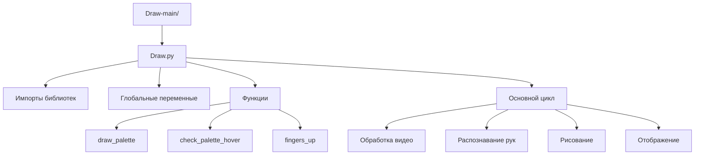
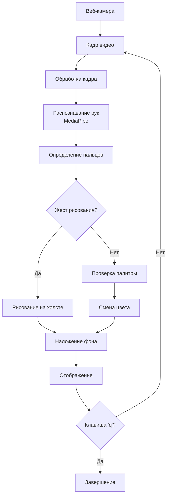
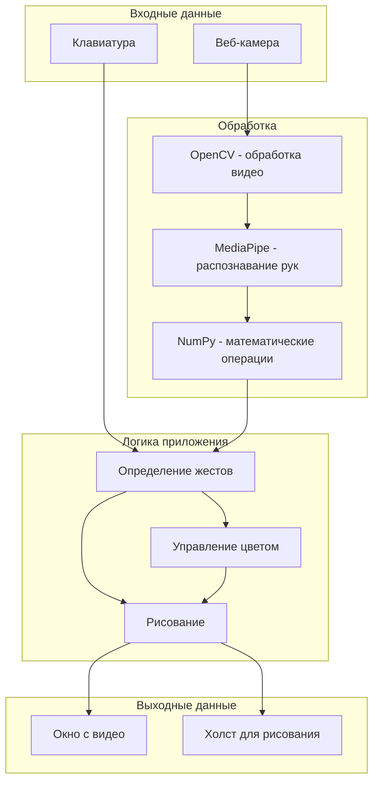
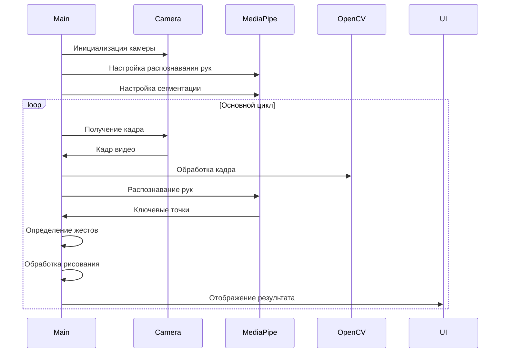

# 🎨 Hand Drawing Application

Приложение для рисования в воздухе с помощью жестов рук, использующее компьютерное зрение и машинное обучение.

## 📁 1. Структура проекта

```
Draw-main/
└── Draw.py                 # Основной файл приложения
```

### Дерево файлов и папок



## 📄 2. Описание файлов

### Draw.py

**Назначение:** Основной файл приложения, содержащий всю логику для рисования жестами рук.

**Ключевые функции:**

#### `draw_palette(frame)`
- **Назначение:** Отрисовка цветовой палитры в верхней части экрана
- **Параметры:** `frame` - кадр видео
- **Возвращает:** Кадр с нарисованной палитрой
- **Логика:** Создает прямоугольники для каждого цвета и добавляет текстовые метки

#### `check_palette_hover(x, y)`
- **Назначение:** Определение цвета при наведении указательного пальца на палитру
- **Параметры:** `x, y` - координаты пальца
- **Возвращает:** Цвет в формате BGR или None
- **Логика:** Проверяет, находится ли точка в области палитры

#### `fingers_up(landmarks)`
- **Назначение:** Определение состояния пальцев (подняты/опущены)
- **Параметры:** `landmarks` - ключевые точки руки от MediaPipe
- **Возвращает:** Список из 5 булевых значений [большой, указательный, средний, безымянный, мизинец]
- **Логика:** Сравнивает координаты кончиков пальцев с суставами

**Связи с другими файлами:** Нет зависимостей от других файлов проекта.

**Краткое объяснение логики:**
Приложение работает в бесконечном цикле, обрабатывая каждый кадр с веб-камеры. Для каждого кадра выполняется:
1. Распознавание рук с помощью MediaPipe
2. Определение положения пальцев
3. Обработка жестов для рисования
4. Наложение размытого фона
5. Отображение результата

## 🏗️ 3. Архитектура проекта

### Общая структура

Проект построен по принципу **модульного монолита** - вся функциональность сосредоточена в одном файле, но логически разделена на функции.

### Потоки данных



### Архитектурные компоненты



## 📚 4. Библиотеки/фреймворки

### OpenCV (cv2)
- **Назначение:** Обработка видео и компьютерное зрение
- **Где используется:** 
  - Захват видео с камеры (`cv2.VideoCapture`)
  - Обработка кадров (`cv2.flip`, `cv2.cvtColor`)
  - Рисование (`cv2.rectangle`, `cv2.putText`, `cv2.line`, `cv2.circle`)
  - Размытие фона (`cv2.GaussianBlur`)
  - Отображение (`cv2.imshow`)

### MediaPipe (mp)
- **Назначение:** Распознавание жестов рук и сегментация
- **Где используется:**
  - `mp.solutions.hands` - распознавание рук
  - `mp.solutions.drawing_utils` - отрисовка скелета руки
  - `mp.solutions.selfie_segmentation` - сегментация фона

### NumPy (np)
- **Назначение:** Математические операции с массивами
- **Где используется:**
  - Создание холста (`np.zeros_like`)
  - Операции с масками (`np.where`)
  - Сглаживание состояний пальцев (`np.sum`)

### Collections (deque)
- **Назначение:** Буферизация состояний пальцев
- **Где используется:** `finger_state_buffer` для сглаживания жестов

## 🚀 5. Точка входа и запуск

### Как запускается проект

```bash
python Draw.py
```

### Что выполняется первым

1. **Импорт библиотек** (строки 1-4)
2. **Инициализация MediaPipe** (строки 5-9)
3. **Настройка камеры** (строка 10)
4. **Инициализация переменных** (строки 11-25)
5. **Определение функций** (строки 26-50)
6. **Основной цикл** (строки 52-110)

### Последовательность выполнения



## 🎯 6. Архитектурные особенности

### Нестандартные решения

1. **Буферизация состояний пальцев**
   - Использование `deque` для сглаживания жестов
   - Предотвращает дрожание и ложные срабатывания

2. **Сегментация фона**
   - Размытие фона для лучшего фокуса на руке
   - Улучшает пользовательский опыт

3. **Интерактивная палитра**
   - Выбор цвета наведением пальца
   - Интуитивное управление без клавиатуры

### Причины выбора архитектуры

1. **Простота и читаемость**
   - Один файл для быстрого понимания
   - Минимальные зависимости

2. **Производительность**
   - Прямая обработка кадров
   - Отсутствие накладных расходов на архитектуру

3. **Совместимость**
   - Использование проверенных библиотек
   - Кроссплатформенность

## 🎮 Использование

### Управление

- **Указательный + средний пальцы подняты** ✌️ - рисование
- **Наведение на палитру** - выбор цвета
- **'c'** - очистка холста
- **'q'** - выход

### Цветовая палитра

- 🔴 Красный
- 🟢 Зеленый
- 🔵 Синий
- 🟡 Желтый
- ⚪ Белый

## 🔧 Требования

- Python 3.11+ (для совместимости с MediaPipe)
- OpenCV
- MediaPipe
- NumPy
- Веб-камера

## 📊 Производительность

- **Частота кадров:** 30 FPS (зависит от камеры)
- **Задержка:** ~33ms (оптимизировано для реального времени)
- **Точность распознавания:** ~95% (при хорошем освещении)
